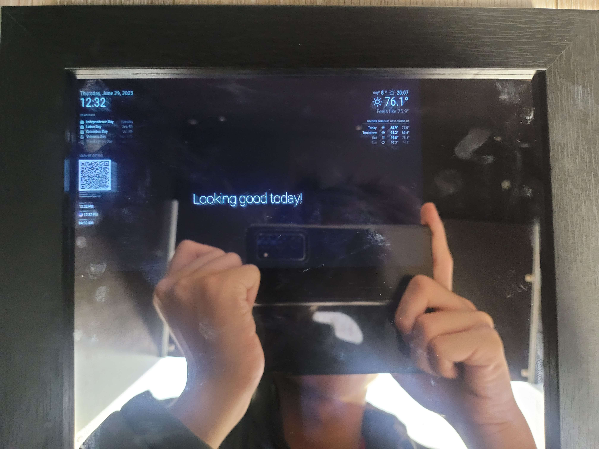

# Raspberry Pi Smart Mirror
This is the Smart Mirror that I built during my time at BlueStamp Engineering. It's a screen embedded behind a piece of mirrored acrylic and can show the user the time, news, weather, and holidays while remaining a mirror at the same time. It uses MagicMirror software commonly used by other smart mirrors in conjunction with a Raspberry Pi 4b to create a project that is both compact and elegant.

| **Engineer** | **School** | **Area of Interest** | **Grade** |
|:--:|:--:|:--:|:--:|
| Ethan L | Glen A. Wilson High School | Computer Science | Incoming Junior

**Replace the BlueStamp logo below with an image of yourself and your completed project. Follow the guide [here](https://tomcam.github.io/least-github-pages/adding-images-github-pages-site.html) if you need help.**

  
# Final Milestone
For my final milestone, I've fully completed and assembled the Smart Mirror as a final product. The 7-inch IPS screen sits behind a 2-way acrylic mirror that creates an illusion of a Magic Mirror.
- Since my second milestone, I have assembled the Smart Mirror onto a 8.5 x 11 picture frame and completed the project in it's entirety.
- My biggest challenges with BlueStamp Engineering were learning how to work around a completely unfamiliar operating system and computer system. Some of my triumphs at BlueStamp Engineering were when I finally got the Raspberry Pi to boot and load the Magic Mirror software for the first time using PM2.
- During my time at BlueStamp Engineering, I've learned how to work with Linux terminals and operating systems, which were very unfamiliar to me before my enrollment in this program.
- I hope to learn more about the concepts and subject of Computer Science, as well as Mechanical engineering after my time at BlueStamp.

<iframe width="560" height="315" src="https://www.youtube.com/embed/FkAimSxB3Dw" title="YouTube video player" frameborder="0" allow="accelerometer; autoplay; clipboard-write; encrypted-media; gyroscope; picture-in-picture; web-share" allowfullscreen></iframe>

# Second Milestone
For my second milestone, I've added additional functionality to the Smart Mirror Software as well as a few modifications.
- Technical details: I've added my home wifi in the top left corner as a new module modification as well as a world clock in the middle left.
- Challenges: This project marks my first time ever working with a Raspberry Pi/Linux operating system. So it was a little tricky learning to work around and use the terminal effectively compared to using windows.
- I'm looking to finish modifications to the mirror and have my final milestone be actually assembling the mirror as a tangible object.

<iframe width="560" height="315" src="https://www.youtube.com/embed/8tbGLLOlhSI" title="YouTube video player" frameborder="0" allow="accelerometer; autoplay; clipboard-write; encrypted-media; gyroscope; picture-in-picture; web-share" allowfullscreen></iframe>

# First Milestone
I plan to build the Smart Mirror with the open source MagicMirror software for the Raspberry Pi.
- The only component of the Smart Mirror I have on hand now is the Raspberry Pi, as I plan to fully develop the software portion of this project before proceeding onto hardware.
- Technical progress: I have configured time, calendar, weather, compliments, and news to be displayed correctly through the software.
- Challenges: I had trouble with creating the mm.sh file to autostart the Magic Mirror, but my instructor Mr. Remston guided me through that. I have also had challenges with the config.js file as well as the OpenWeather API, as it was my first time working with these elements. I worked through the config.js files by instead going through the module folder, rather than editing everything within the config.js file. 
- I plan to put the Raspberry Pi onto a 7 inch IPS display in a frame to complete this project, as well to add more modules and modifications.

<iframe width="560" height="315" src="https://www.youtube.com/embed/PQV4ZbAJ9d4" title="YouTube video player" frameborder="0" allow="accelerometer; autoplay; clipboard-write; encrypted-media; gyroscope; picture-in-picture; web-share" allowfullscreen></iframe>

# Code
Listed below are the modifications and code that have been used for the creation of the Smart Mirror.

| **Software** | **Purpose** | **Utility** | **Link** |
|:--:|:--:|:--:|:--:|
| MagicMirror| This is the core software for the Smart Mirror, where all modules are based off of. | Base Module | <a href="https://github.com/MichMich/MagicMirror/"> Link </a> |
|:--:|:--:|:--:|:--:|
| WorldClock Module| This module displays the time from various different countries and areas of interest. | World Clock(Time) | <a href="https://github.com/ulrichwisser/worldclock/"> Link </a> |
|:--:|:--:|:--:|:--:|
| Home Wifi Module| This is the module that allows for the customization of a QR code to display the user's home Wi-Fi. | Home Wifi Accessibility | <a href="https://github.com/TeraTech/MMM-WiFiPassword/"> Link </a> |
|:--:|:--:|:--:|:--:|

# Bill of Materials
These are all the parts I've used in the physical construction of the Smart Mirror, prices may vary depending on date of purchase.

| **Part** | **Note** | **Price** | **Link** |
|:--:|:--:|:--:|:--:|
| Raspberry Pi 4b Starter Kit| This is the core component for the smart mirror that connects to the monitor | $119.96 (at current time) | <a href="https://www.pishop.us/product/raspberry-pi-4b-starter-kit/"> Link </a> |
|:--:|:--:|:--:|:--:|
| Hosyond 7 inch IPS LCD | This is the LCD used to display the output from the Raspberry Pi | $49.98 | <a href="https://www.amazon.com/Hosyond-Display-1024%C3%97600-Capacitive-Raspberry/dp/B0BKGCB18T/?_encoding=UTF8&pd_rd_w=aPLf0&content-id=amzn1.sym.dba1a2d0-88dc-4504-a5d7-10259373e587&pf_rd_p=dba1a2d0-88dc-4504-a5d7-10259373e587&pf_rd_r=PW3XKRJXNFG3N0EQQDB9&pd_rd_wg=TeUvQ&pd_rd_r=a8622e2d-cbc6-458e-b09d-7f4773598fec&ref_=pd_gw_ci_mcx_mr_hp_atf_m&th=1"> Link </a> |
|:--:|:--:|:--:|:--:|
| Two Way Acrylic Mirror | This item is used so that the LCD can display from behind the mirror to give a Magic Mirror effect. | $33.59 | <a href="https://www.amazon.com/SPEEDYORDERS-Acrylic-Through-Plexiglass-Unbreakable/dp/B09QQPX3TS/ref=sr_1_6?crid=15UVEJN4UC68B&keywords=2%2Bway%2Bacrylic%2Bmirror&qid=1687375092&sprefix=2%2Bway%2Bacryli%2Bmirror%2Caps%2C154&sr=8-6&th=1"> Link </a> |
|:--:|:--:|:--:|:--:|
| Picture Frame 8.5 x 11 | This item is used to house the mirror and the LCD. | $10.99 | <a href="https://www.amazon.com/MCS-Industries-63705-Gallery-Woodgrain/dp/B08179L7SD/ref=sr_1_45?crid=36PZUY91AR5B2&keywords=picture+frame&qid=1687377797&sprefix=picture+frame%2Caps%2C163&sr=8-45"> Link </a> |
|:--:|:--:|:--:|:--:|
